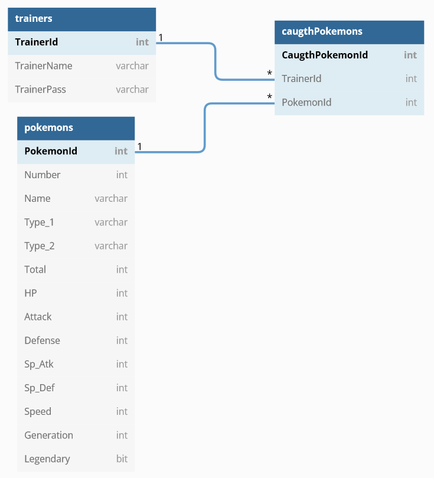
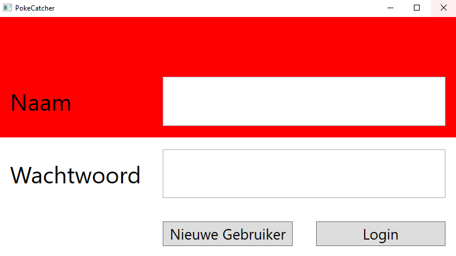
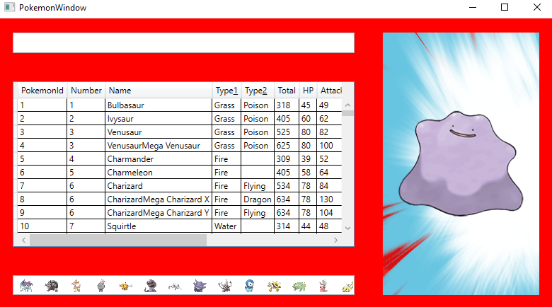

# LINQ-4---PokemonCatcher

In deze oefening ga je een **DataSet** (disconnected datamodel) bouwen om **Pokémons**, **Trainers** en de **gevangen Pokémons van trainers** op te slaan.

Voor een deel van de data ga je een **SQL script** gebruiken (`PokemonScript.sql`). Vervolgens gebruik je een `SqlDataAdapter` om dat deel van de DataSet in te laden.


## SQL Script

```sql
-- Als tabel bestaat droppen
DROP TABLE IF EXISTS Pokemons;

CREATE TABLE [dbo].[Pokemons] (
    [PokemonId] [int] NOT NULL,
    [Number] [int] NOT NULL,
    ...
);
```



## Applicatie Layout

De layout van de applicatie is al volledig voorzien. Je zal de uitgewerkte XAML terug vinden in het Skelet van de oefening.

Op het eerste venster kan de gebruiker zich inloggen. Elke trainer zal zijn eigen gevangen pokemons kunnen terugvinden.



Eens ingelogd worden er willekeurige pokemons getoond elke vijf seconden. Indien de gebruiker snel genoeg de naam kan ingeven, dan zal hij deze pokemon “vangen” en terug kunnen vinden in de ListBox onderaan het venster.



Al de mogelijke interacties met de Data laag zijn al bepaald in de Business laag van de MainWindow en PokemonWindow klasse. Je moet echter wel nog de methodes in de ClassLibrary uitwerken. Hiervoor zal je zowel **LINQ** als **ADO.NET** moeten gebruiken.

## ClassLibrary

### DataProcessing

- **`InitializeDataProcessing()`**  
  Wordt opgeroepen bij het starten van de applicatie.  
  Voert de statische constructors uit van `TrainerData`, `PokemonData` en `CaugthPokemonData`.  
  Indien de `DataSet` nog nooit is opgeslagen, wordt `InitializeNewDataSet()` aangeroepen.

- **`InitializeNewDataSet()`**  
  Voegt de `DataTables` van `TrainerData`, `PokemonData` en `CaugthPokemonData` toe aan de `DataSet`.  
  Elke `DataTable` wordt geïnitialiseerd via de statische constructor.

- **`SaveTrainerDataSet()`**  
  Exporteert de volledige `DataSet` naar **XML-formaat**.


### PokemonData

- **`InitializePokemonDataTable()`**  
  Maakt een connectie met de database en leest de `Pokemons`-tabel uit via `SqlDataAdapter` en `.Fill()`.  
  Maakt een **kopie** van de `DataTable` (.Copy()) en slaat deze op.

- **`GetPokemonDataView()`**  
  Geeft een `DataView` terug van de `PokemonDataTable`.

- **`GetPokemonDataViewByNameFilter(string filter)`**  
  Gebruikt een **LINQ-query** om de `DataTable` te filteren op `Name`.  
  Alle pokémons waarvan de naam het opgegeven filter bevat, worden getoond.

- **`GetMaxPokemonNumber()`**  
  Gebruikt een **LINQ-query** om het **hoogste pokémonnummer** in de `DataTable` te vinden.


### TrainerData

- **`InitializeTrainerDataTable()`**  
  Maakt een nieuwe `DataTable` aan met de kolommen zoals gespecificeerd in het datamodel.

- **`CreateTrainer(string trainerName, string password)`**  
  Maakt een nieuwe `DataRow` aan in de `TrainerDataTable`.  
  Gebruik `GetNextTrainerId()` om de correcte `TrainerId` toe te wijzen.

- **`GetNextTrainerId()`**  
  LINQ-query die bepaalt wat de **hoogste huidige `TrainerId`** is.  
  Deze waarde wordt met 1 verhoogd en teruggegeven.

- **`CheckTrainerLogin(string trainerName, string password)`**  
  LINQ-query die controleert of `trainerName` en `password` bestaan in de `TrainerDataTable`.

- **`CheckUniqueTrainerName(string trainerName)`**  
  LINQ-query die nagaat of `trainerName` nog **niet** bestaat in de `TrainerDataTable`.

- **`GetTrainerIdByTrainerName(string trainerName)`**  
  LINQ-query die de `TrainerId` teruggeeft van een unieke `trainerName`.


### CaugthPokemonData

- **`InitializeCaugthPokemonDataTable()`**  
  Maakt een nieuwe `DataTable` aan met de kolommen zoals gespecificeerd in het datamodel.

- **`GetNextCaugthPokemonId()`**  
  LINQ-query die bepaalt wat de **hoogste huidige `CaugthPokemonId`** is.  
  Deze waarde wordt met 1 verhoogd en teruggegeven.

- **`GetCaugthPokemonIdsByTrainerId(int trainerId)`**  
  LINQ-query die een lijst van `pokemonNumber` (integers) teruggeeft voor alle pokémons gevangen door de trainer met het opgegeven `trainerId`.

- **`CatchPokemon(int trainerId, int pokemonNumber)`**  
  Voegt een nieuwe `DataRow` toe aan `CaugthPokemonData`.  
  Gebruik `GetNextCaugthPokemonId()` om het juiste ID toe te wijzen.

**Let op**: Bij al deze methodes werk je in een **disconnected ADO.NET omgeving** met behulp van `DataSet`, `DataTable`, `DataRow`, `DataView` en `LINQ to DataSet`.
